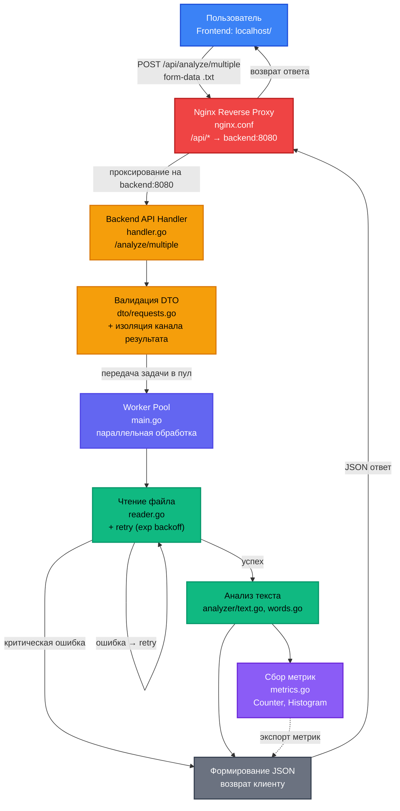

# Text Analyzer

Высокопроизводительный микросервис для анализа текстовых файлов (.txt), предоставляющий расширенные метрики текста и готовый к развертыванию в production-среде.

Приложение состоит из **Backend** (Go) и **Frontend** (HTML/JS/CSS). Бэкенд отвечает за тяжелую аналитику и управление ресурсами, фронтенд предоставляет удобный интерфейс для загрузки файлов и скачивания результатов.

## 🚀 Возможности

*   **Комплексный анализ текста:** вычисление ключевых метрик для любого загруженного `.txt` файла.
*   **Экспорт результатов:** фронтенд позволяет сохранить отчет об анализе в локальный `.txt` файл.
*   **Production-ready архитектура:**
    *   **Graceful Shutdown:** корректное завершение работы без потери данных и прерывания текущих задач.
    *   **Worker Pool:** параллельная обработка запросов для высокой пропускной способности.
    *   **Observability:** встроенные метрики Prometheus для мониторинга состояния системы.
    *   **Документация:** автоматическая генерация Swagger UI для API.
    *   **Надежность:** механизм повторных попыток (retry) с экспоненциальной задержкой при чтении файлов.

## 📊 Ключевые метрики

Сервис автоматически рассчитывает следующие показатели:

*   📄 Количество строк.
*   🔤 Количество символов.
*   💬 Количество предложений.
*   🗣️ Количество слов.
*   📏 Средняя длина слова.
*   🏆 Самое длинное слово.
*   📈 Топ-N самых частых слов (настраиваемый параметр).

## 🗂 Структура проекта

Ниже представлена иерархия проекта с кратким описанием ключевых директорий:

```
TextAnalyzer/ 
├── cmd/app/                   # Точка входа приложения (main.go) 
├── configs/                   # Конфигурация (config.yaml) 
├── docs/                      # Сгенерированная документация Swagger 
├── frontend/                  # Клиентская часть (index.html, script.js, style.css) 
├── internal/ 
│ ├── api/                     # Обработчики API и DTO модели 
│ ├── config/                  # Логика загрузки конфигурации 
│ ├── metrics/                 # Экспортер метрик Prometheus 
│ └── service/ 
│	├── analyzer/              # Бизнес-логика анализа (text.go, words.go) + тесты
│	└── reader/                # Чтение файлов с реализацией retry-логики (reader.go) + тесты
├── .dockerignore 
├──	.gitignore 
├── .env
├── Dockerfile                 # Multi-stage сборка образа 
├── docker-compose.yml         # Оркестрация сервисов (backend, frontend, nginx) 
├── Makefile                   # Упрощенные команды для разработки 
└── nginx.conf                 # Конфигурация проксирования для фронтенда
```

## 💻 Локальный запуск

### Вариант 1: Использование Makefile (рекомендуется)

Если у вас установлена утилита `make`, это самый быстрый способ запуска.

1.  Клонируйте репозиторий:
    ```bash
    git clone https://github.com/coddemn/TextAnalyzer.git
    cd TextAnalyzer
    ```
2.  **Запуск без Docker:**
    ```bash
    make run
    ```
3.  **Запуск с Docker (рекомендуется для полного стека):**
    ```bash
    make up
    ```
4.  **Просмотр логов:**
    ```bash
    make logs
    ```

### Вариант 2: Ручной запуск (без Make)

Если утилита `make` не установлена:

**Для запуска без Docker:**
1.  Установите и инициализируйте Swag (если не установлен):
    ```bash
    go install github.com/swaggo/swag/cmd/swag@latest
    swag init -g cmd/app/main.go -o docs
    ```
2.  Запустите приложение:
    ```bash
    go run ./cmd/app
    ```

**Важно!** Если приложение запускать без докера - корректно будет работать только API по локальному адресу localhost:8080. Фронтенд можно посмотреть, открыв вручную index.html в браузере, однако запросы не дойдут до сервера (из за отсутствия проксирования nginx в контейнере docker) 
 
**Для запуска с Docker:**
1.  Соберите и запустите контейнеры:
    ```bash
    docker compose up -d --build
    ```
2.  Просмотр логов конкретного сервиса:
    ```bash
    docker compose logs -f backend
    # или
    docker compose logs -f frontend
    ```

---

## 🧠 Архитектура и реализация

### Чтение файлов и отказоустойчивость
Модуль `reader` реализует потоковое чтение файлов построчно, что позволяет обрабатывать большие файлы без загрузки их целиком в память. Встроена логика **retry с экспоненциальной задержкой**: при ошибке чтения система делает паузу (длительность задается в конфиге) и повторяет попытку. Если лимит попыток исчерпан, возвращается структурированная ошибка.

### Анализ текста
Логика анализа разделена на два файла в пакете `analyzer`:
*   `text.go`: подсчет строк, символов, предложений и токенизация текста.
*   `words.go`: подсчет слов, расчет средней длины, поиск самого длинного слова и формирование топа частых слов.
Функция `Run()` агрегирует данные из обоих модулей в единый результат.

### Мониторинг (Prometheus)
Сервис экспортирует следующие метрики:
*   **Counter:** количество обработанных/ошибочных файлов, успешные/неудачные retry-попытки.
*   **Histogram:** время обработки запроса (latency).
*   **Gauge:** текущее количество активных воркеров в пуле.

### API и безопасность
*   **Endpoints:** `/analyze/multiple`, `/health`, `/metrics`.
*   **DTO:** используются строго типизированные модели данных для валидации входящих запросов и изоляции результатов между пользователями (используются каналы для передачи результатов).
*   **CORS:** настроены правила для корректной работы с фронтендом.

### Тестирование
Проект покрыт тестами:
*   **Unit-тесты:** для всех функций бизнес-логики (`analyzer_test.go`, `reader_test.go`).
*   **Интеграционные тесты:** для API эндпоинтов с использованием пакета `net/http/httptest`.

### Контейнеризация
Используется **multi-stage сборка** в `Dockerfile`:
1.  Компиляция бинарного файла на базе образа с Go.
2.  Создание минимального образа на базе `alpine` или `distroless`, куда копируется только бинарник и статические файлы.
3.  В процессе сборки автоматически генерируется документация Swagger.

`docker-compose.yml` объединяет сервисы `backend`, `frontend` и `nginx` в единую сеть. Nginx выступает в роли reverse proxy, перенаправляя запросы к соответствующим сервисам.

## 📄 Конфигурация

Настройки приложения хранятся в двух местах:
1.  `configs/config.yaml`: основные параметры (таймауты, кол-во воркеров, максимальное кол-во файлов, кол-во слов в топ N, количество попыток retry).
2.  `.env`: переменные окружения (хост, порт).

Логика загрузки конфигурации инкапсулирована в пакете `internal/config`.

## 🧪 Примеры запросов к API

Основной эндпоинт для анализа — `POST /analyze/multiple`. Он принимает несколько файлов `.txt` в формате `multipart/form-data`.

> **Windows / PowerShell:** В PowerShell `curl` — это алиас на `Invoke-WebRequest`, а не настоящая утилита. Используйте `curl.exe` (с точкой) и обратный апостроф `` ` `` для переноса строк.

### Анализ файлов

**Bash (Linux / macOS / Git Bash):**
```bash
# Отправка одного файла, вывод ответа в терминал
curl -X POST http://localhost:8080/analyze/multiple \
  -F "files=@sample.txt"

# Отправка двух файлов, сохранение ответа в report.json
curl -X POST http://localhost:8080/analyze/multiple \
  -F "files=@file1.txt" \
  -F "files=@file2.txt" \
  -o report.json
````

**PowerShell (Windows):**

```powershell
# Отправка одного файла, вывод ответа в терминал
curl.exe -X POST http://localhost:8080/analyze/multiple `
  -F "files=@sample.txt"

# Отправка двух файлов, сохранение ответа в report.json
curl.exe -X POST http://localhost:8080/analyze/multiple `
  -F "files=@file1.txt" `
  -F "files=@file2.txt" `
  -o report.json
```

### Health Check

```bash
# Bash
curl http://localhost:8080/health
```

```powershell
# PowerShell
curl.exe http://localhost:8080/health
```

### Просмотр метрик Prometheus

Чтобы отфильтровать только метрики приложения (с префиксом `analyzer_`):

```bash
# Bash
curl -s http://localhost:8080/metrics | grep "analyzer_"
```

```powershell
# PowerShell
curl.exe -s http://localhost:8080/metrics | Select-String "analyzer_"
```

> **Документация Swagger UI** доступна по адресу `http://localhost:8080/swagger/index.html` — там можно протестировать эндпоинт `/analyze/multiple` прямо в браузере, выбрав файлы через интерфейс.

## 🗺️ Диаграмма потока данных

Схема демонстрирует полный путь запроса: от фронтенда через Nginx-прокси до воркер-пула бэкенда, включая механизмы отказоустойчивости и мониторинга.

Архитектура приложения построена по принципу разделения ответственности. Фронтенд отправляет запросы на путь /api/.... Встроенный Nginx (настроенный в nginx.conf) выступает в роли Reverse Proxy: он перехватывает запросы с префиксом /api и прозрачно перенаправляет их на сервис бэкенда (backend:8080), скрывая внутреннюю структуру сети от клиента.



## 🤝 Вклад в проект

Pull Request'ы приветствуются! Пожалуйста, следуйте стандартам именования и добавляйте тесты для нового функционала.

## 📜 Лицензия

Проект распространяется под лицензией MIT.
